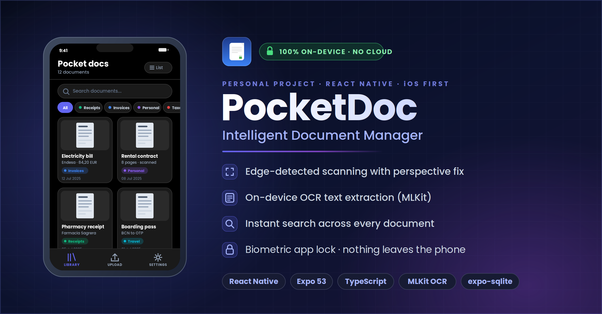
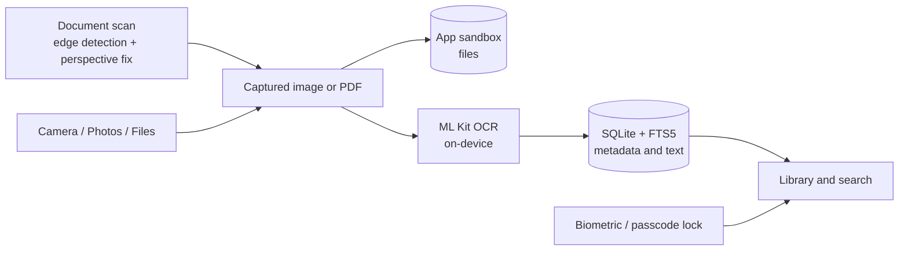

# PocketDoc — private document manager for iPhone



Scan, read and find your personal documents — receipts, invoices, contracts, boarding passes — without them ever leaving your phone.

**Personal project** · React Native 0.79 / Expo 53 · TypeScript · iOS first · MVP tested via TestFlight

## What it does

- **Capture** — four ways in: document scan with edge detection and perspective correction, camera photo, photo library, or file/PDF import.
- **Read** — on-device OCR with Google ML Kit. If recognition fails, the app says so; it never invents text.
- **Organise** — categories (Receipts, Invoices, Personal, Taxes, Travel) plus your own title, description and tags.
- **Find** — full-text search across titles, tags, descriptions and extracted text (SQLite FTS5).
- **Protect** — biometric or passcode app lock; credentials kept in the iOS Keychain.

## Architecture



No backend, no analytics, no network calls: everything runs and is stored on the device.

## Design decisions

1. **Privacy first — nothing leaves the phone.** The main branch has no backend and makes no network calls. Files live in the app sandbox; metadata and OCR text live in a local SQLite database.
2. **Honest OCR.** An early version filled in placeholder text when recognition failed. That was removed: a failed scan is shown as a failure. Trust matters more than a demo that always "works".
3. **Cloud AI kept on a separate branch.** The `cloud-processing` branch experiments with an LLM (gpt-4o-mini) that writes descriptions and tags from the OCR text. It is not merged into `main` because it would send document content off the device, breaking decision 1. Options for bringing it back: opt-in per document, or an on-device model.

## How it was built

Built with AI coding agents in a spec-driven workflow: prototyped in Bolt, then developed with Claude Code. Four documents in the repo steer the agent:

| File | Role |
|---|---|
| [`PRD.md`](PRD.md) | What to build: requirements, scope, success criteria |
| [`PLANNING.md`](PLANNING.md) | How to build it: architecture and technology choices |
| [`TASKS.md`](TASKS.md) | Where the work stands: status and priorities |
| [`CLAUDE.md`](CLAUDE.md) | Rules the agent follows in every session, including the order in which to read the three files above |

## Status and known limitations

- MVP distributed to testers through TestFlight (summer 2025); not yet on the public App Store.
- A refresh is planned for late 2026.
- Documents rely on iOS's built-in data protection; the app does not add its own encryption layer yet.
- iOS first. Android is configured but not a focus yet.
- `services/passkeyAuth.ts` is an unused prototype for passkey sign-in.

## Run it locally

Requirements: macOS with Xcode and CocoaPods, Node.js 18+, an iPhone (recommended) or the iOS Simulator.

```bash
git clone https://github.com/apanainte/pocket-doc.git
cd pocket-doc
npm install
cd ios && pod install && cd ..
npx expo run:ios --device
```

Scanning and OCR use native modules, so they need a development build rather than Expo Go. More detail in [`docs/INSTALLATION_GUIDE.md`](docs/INSTALLATION_GUIDE.md).

## Tech stack

React Native 0.79 · Expo 53 · Expo Router · TypeScript · expo-sqlite (FTS5) · react-native-mlkit-ocr · react-native-document-scanner-plugin · expo-local-authentication · expo-secure-store

## Author

**Andrei Panainte** — Solutions Architect, AI adoption · [LinkedIn](https://www.linkedin.com/in/andrei-panainte)
